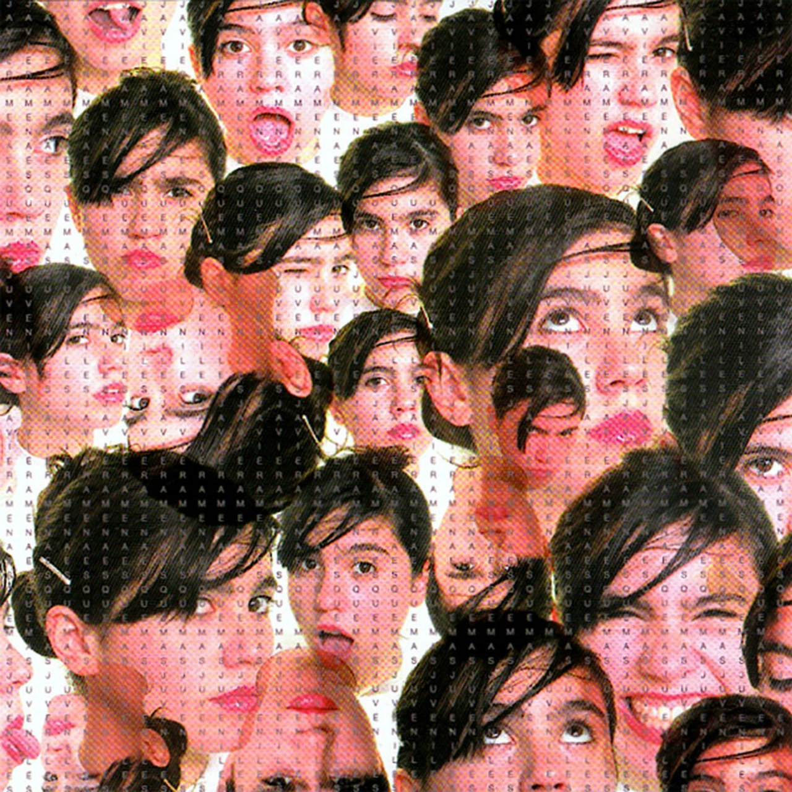

# Solemne 2 

## Integrantes del grupo

Alejandro Fernández - https://github.com/piromantico

Constanza Cáceres - https://github.com/fullpiketia




Esquemas Juveniles

2006

Javiera Mena

Tracklist: 

1. Al siguiente nivel
2. Esquemas juveniles
3. Como siempre soñé
4. Sol de invierno (con Gepe)
5. Cámara lenta
6. Casan (no puedo bloquear lo que quiero dar)
7. Cuando hablamos
8. Está en tus manos
9. Yo no te pido la luna
10. Perlas

**Aspecto del álbum a desarrollar**

Con este código quisimos abordar una canción en especifico dentro del álbum, 'Sol de invierno', canción que retrata el querer olvidar a alguien después de una relación, pero haciendólo de forma tranquila, introspectiva y solitaria, sin 'atados'

## Conclusión del proceso


**Distancia entre premisa y resultado**


Finalmente logramos retratar ésta canción y lo que busca expresar basándonos un poco más en la soledad cómo foco principal, con un asiento/banca de plaza, de color verde cómo elementro central inferior, carácterístico de las plazas de barrio chilenas, ésta se encuentra vacía, mientrás las nubes avanzan, y la escena alterna entre día y noche, demostrando cómo después de esta ruptura, el tiempo sigue su flujo.

**Cosas no conseguidas**

En una instancia pensamos en agregar a una pareja en el asiento, o una sola persona, al probar sentimos que quedaba más decorativo que un aporte en sí a la composición y al código, sin embargo hubiera sido un hallazgo descubrir como integrarlo.


**Descubrimientos al trabajar**

Descubrimos que se podían incorporar audios/música, de forma loca, primero habíamos pensado que sólo se podía con bibliotecas de audio de p5, pero con asistencia de **ChatGPT** pudimos llegar al hallazgo de que podíamos utilizar cualquier pieza de audio, he ahí donde finalmente nace la idea de utilizar el audio y transformar este canvas junto con el código en una especie de video de letras de la canción.


## Explicación del código

**Bloque de código 1: Variables y configuración inicial**

`let estrellas = [];`


`let nubes = [];`


`let modoNoche = true;`


`let cancion;`


`let lyricIndex = 0;`


`let musicaIniciada = false;`


`let velocidadLyrics = 475;`


`let tiempoInicio = 0;`


`let lyrics = [ ... ];`


`function preload() { ... }`


`function setup() { ... }`

En este bloque se declaran todos las variables que el sketch necesita 'grabar' para posteriormente ser llamados: los arrays de estrellas y nubes, el modo del fondo (día/noche), la canción y los lyrics, preload() carga el audio antes de cargarlo definitivamente y setup() crea el canvas generando las estrellas y nubes por primera vez.

**Bloque de código 2: Visualidad e interacción

`function draw() { ... }`


`function mousePressed() { ... }`


`function dibujarBanca() { ... }`


Es el centro del código, draw() es ejecutado constantemente y dibuja todo en el lienzo: el fondo de día o noche, la luna o el sol, las estrellas, las nubes, el suelo, la banca y los lyrics, un poco cómo Dios, solo que no en 7 días, solo en un click, o dos. mousePressed() detecta cada click para alternar entre día y noche e iniciar la canción. dibujarBanca() dibuja la banca central.

**Bloque de código 3: Clase Nube**


Define el comportamiento de cada nube como objeto independiente. constructor() se encarga de asignarle a cada nube su posición, velocidad y tamaño aleatorio al nacer, la primera vez que se corre el código. update() las mueve hacia la derecha cada frame y la devuelve por la izquierda al salirse completamente del canvas, ni antes ni después, display() las dibuja con tres elipses superpuestos, los cuáles cambian de color según si es de día o de noche.


## Declaración del uso de IA

**IAs utilizadas:** ChatGPT y Claude gratuitas

**Problema a resolver a través de la IA**

Cuándo se nos ocurrió la idea de alternar entre día y noche, inicialmente el fondo sólo sería azul de noche, y un tono más claro de día, luego añadimos el sol y la luna, luego pensamos en añadir elementos en movimiento: las nubes, ¿Cómo las creamos y hacemos que se muevan cómo nubes?, luego llegó la idea de añadir estrellas ¿Son millones de puntos que poner a mano? ¿Siempre en el mismo lugar? por último también necesitamos asistencia respecto al reinicio del código junto con la canción. A través de la IA pudimos darle más dinamismo y vida a nuestro código, a continuación se presentan los prompts utilizados:

**"quiero un cielo con nubes en movimiento que se desplacen lentamente de un lado a otro"**

**Respuesta de ChatGPT:**

```
let nubes = [];
function setup() {
  createCanvas(windowWidth, windowHeight);
  // crear varias nubes
  for (let i = 0; i < 8; i++) {
    nubes.push({
      x: random(width),
      y: random(50, 250),
      tamaño: random(60, 120),
      velocidad: random(0.2, 1)
    });
  }
}

function draw() {
  background(120, 180, 255);
  // dibujar nubes
  for (let nube of nubes) {
    fill(255, 220);
    noStroke();
    ellipse(nube.x, nube.y, nube.tamaño, nube.tamaño * 0.6);
    ellipse(nube.x + 30, nube.y + 10, nube.tamaño * 0.7, nube.tamaño * 0.5);
    ellipse(nube.x - 30, nube.y + 10, nube.tamaño * 0.7, nube.tamaño * 0.5);
    // movimiento
    nube.x += nube.velocidad;
    // reaparece al otro lado
    if (nube.x > width + 100) {
      nube.x = -100;
    }
  }
}
```

**"mi cancion dura 34 segundos, quiero que una vez terminen los 34, se pare, se quede en silencio, y el codigo se reinicie"**

**Respuesta de Claude

```
function draw() {
  if (musicaIniciada && millis() - tiempoInicio > 34000) {
    cancion.stop();
    musicaIniciada = false;
  }
  if (musicaIniciada) {
    let segundos = (millis() - tiempoInicio) / 1000;
    lyricIndex = floor(segundos / (34 / lyrics.length)) % lyrics.length;
    text(lyrics[lyricIndex], width / 2, height * 0.12);
  } else {
    text("HAZ CLICK PARA COMENZAR", width / 2, height * 0.12);
  }
}
function mousePressed() {
  if (!cancion.isPlaying()) {
    cancion.play();
    cancion.setVolume(0.5);
    musicaIniciada = true;
    tiempoInicio = millis();
  }
}
```

**"cómo hago para alternar entre día y noche con un click"**

**Respuesta de ChatGPT:**

```
let modoNoche = true;
function draw() {
  if (modoNoche) {
    background(10, 10, 30); // noche
  } else {
    background(255, 220, 180); // día
  }
}
function mousePressed() {
  // cambia entre true y false
  modoNoche = !modoNoche;
}
```

**"agrega estrellas pequeñas al cielo nocturno"**

```
let estrellas = [];

for (let i = 0; i < 300; i++) {
  
  estrellas.push({
    x: random(width),
    y: random(height),
    s: random(1, 4)
  });

  //se encarga de generar las estrellas en posiciones y tamaños randoms
  //cada vuelta crea una nueva estrella y la mete al array

}
```

```
fill(255, 220);

for (let e of estrellas) {
  circle(e.x, e.y, e.s);

  //recorre el array de estrellas y dibuja cada una
}
```    


